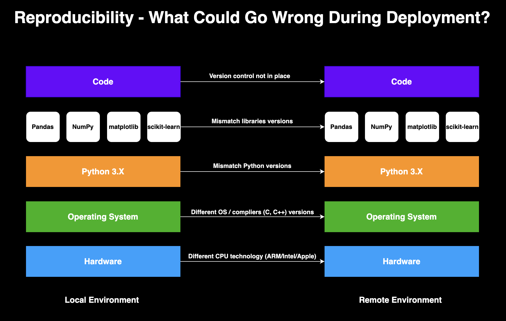

# Introduction to Docker for Data Scientists  🐳.

🚧WIP 🏗️, pre spell checking🛠️

Docker has a variety of applications in the domain of data science and MLOps. It enables a high level of reproducibility, which is one of the core foundations of data science. Along with its benefits, Docker has some learning curve, and the goal of this tutorial is to reduce the entry barrier for data scientists to Docker.

**Table of Content:**
- Motivation
- Installation
- General workflow
- The Dockerfile
- Build an image
- Run a container

## Motivation

In my data science career, one major technical milestone (after learning how to code and adopt Git) was learning Docker and starting to use it. It opened a new world of opportunities, from automating processes to deploying data science work in production. This section defines what Docker is and its data science applications. 

### What is Docker?

Docker is a CI/CD tool that enables seamless code deployment from development to production environments. By creating OS-level virtualization, it can package an application and its dependencies in a virtual container and ship it between different environments. The main advantages of using Docker within your development environment are:
- **Reproducibility -** Docker enables you to seamlessly package your code and its dependencies into a single container and execute, test, share, and deploy it with a high level of consistency
- **Collaboration -** Docker solves the dependencies madness when a team of developers works together on a specific project. Having a unified environment saves a ton of time during the development step. For example, if one developer gets some error, it is easy for other developers to reproduce the error and help debug it
- **Deployment -** Docker simplifies the code shipment from the development environment to the production

### Docker for Data Science

Docker was built to solve a common DevOps problem - the lack of reproducibility when shifting code between different environments (e.g., dev to prod). **Reproducibility** is not limited to DevOps, and it plays a critical role in the field of data science. We can define reproducibility as the ability to generate the **exact outcome** when running the same code **regardless of the user or machine** on which the code is running.

The first time I heard the term reproducibility was during my bachelor's degree, where I learned that reproducibility starts and ends by setting a **seed** number to lock down random numbers. My favorite seed number is 12345.
When I started to work as a data scientist, I realized that reproducibility goes beyond setting a seed number. Here are the main elements that can impact code reproducibility:
- **Version control —** First and foremost, reproducing the same results starts with the ability to track changes in your code
Randomization — Controlling the random generation of numbers by setting the seed number
- **Software version —** The versions of your Python or R (or any other programming language) and its dependencies (e.g., libraries) impact the outcome of your code. For example, code that was built with pandas v1.0 may not run on v2.0 due to function deprecation
- **Operating System (OS) —** Most programming languages, particularly R and Python, use different compilers (e.g., C, C++, etc.) and other built-in OS components. The type of OS and its version could impact the outcome of your code
- **Hardware —** Last but not, the type of hardware (or infrastructure) could impact your results (ARM/Intel/Apple processor, etc)

 

<figure>
</a>
<figcaption> Figure 1 - Shifting code between environments, what could go wrong?</figcaption>
</figure>

 

The first item above, version control, is handled by Git (and Github, Gitlab, Bitbucket, etc.). Randomization, in most cases, can be set by using a seed number (with some edge cases that might be related to OS type). Docker and virtual environment tools provide solutions to package versioning control. In addition, Docker solves potential OS-related issues and supports different hardware configurations.

In most cases, simple applications fail during deployment due to differences and mismatches of settings between the development and deployment (or target) environments.

**Note:** Using a virtual environment is not an alternative to Docker. It actually works well together. While VE is not in the scope of this tutorial, you can read more about the differences between VE and Docker in the following [article](https://medium.com/@rami.krispin/running-python-r-with-docker-vs-virtual-environment-4a62ed36900f).

